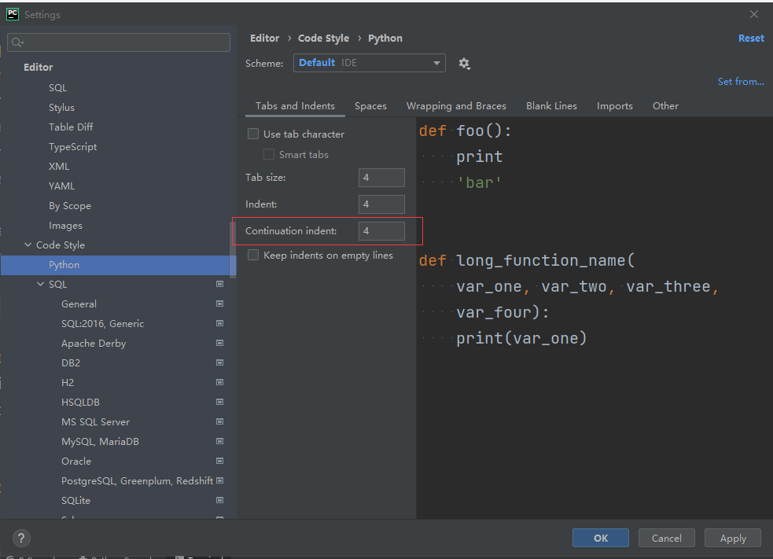

# pycharm_black_强迫症

`屁大点事写个帖子`

pycharm格式化 `Ctrl+Shift+L`，
每次写完(改完)顺手格式化一下，
非常的舒服。

最近开始接触开源项目，
很多用的black格式化工具，
还有mypy等等代码检查工具。

冲突点在于pycharm另起的一行的参数空8格，
black空四格。

在用black风格检查的代码的情况下，
pycharm的格式化显得不友好了。

最开始想直接pycharm reformat用上black，但是看了看jetbrain的插件：

* [black-pycharm](https://plugins.jetbrains.com/plugin/10563-black-pycharm) 多年未更新
* [BlackConnect](https://plugins.jetbrains.com/plugin/14321-blackconnect) 更新挺多的

BlackConnect要起服务端，而且快捷键不同(Alt + Shift + B)

## 解决方案

后面还是妥协普通编写时用pycharm reformat
提交时统一black格式化

> 需要的是把`Continuation indent` 改为`4`



后期再通过 git hook 格式化或者检查代码

## 关于lint check

参考一下 [fastapi](https://github.com/tiangolo/fastapi.git)

``` bash
mypy fastapi
flake8 fastapi tests
black fastapi tests --check
isort fastapi tests docs_src scripts --check-only
```

或者用python插件 [pre-commit-hooks](https://github.com/harvardfly/simple_calculate_service/blob/master/.pre-commit-config.yaml)
配置参考这个项目 [simple_calculate_service](https://github.com/harvardfly/simple_calculate_service/blob/master/.pre-commit-config.yaml)

``` yaml
# cat .pre-commit-config.yaml
-   repo: https://github.com/pre-commit/pre-commit-hooks
    sha: v1.11.1
    hooks:
    -   id: trailing-whitespace
    -   id: end-of-file-fixer
    -   id: check-json
    -   id: flake8
        exclude: migrations|.*\_local.py|manage.py|settings.py
```

参考 [fastapi-crudrouter](https://github.com/awtkns/fastapi-crudrouter)

``` yaml
  lint:
    runs-on: ubuntu-latest
    steps:
    - uses: actions/checkout@v2
    - name: Set up Python
      uses: actions/setup-python@v2
    - name: Run Black Code Formatter
      uses: psf/black@stable
    - name: Install dependencies
      run: |
        python -m pip install --upgrade pip
        pip install -r tests/dev.requirements.txt
    - name: Check Typing with mypy
      run: |
        mypy fastapi_crudrouter
    - name: Lint with flake8
      run: |
        flake8 fastapi_crudrouter
```

---


