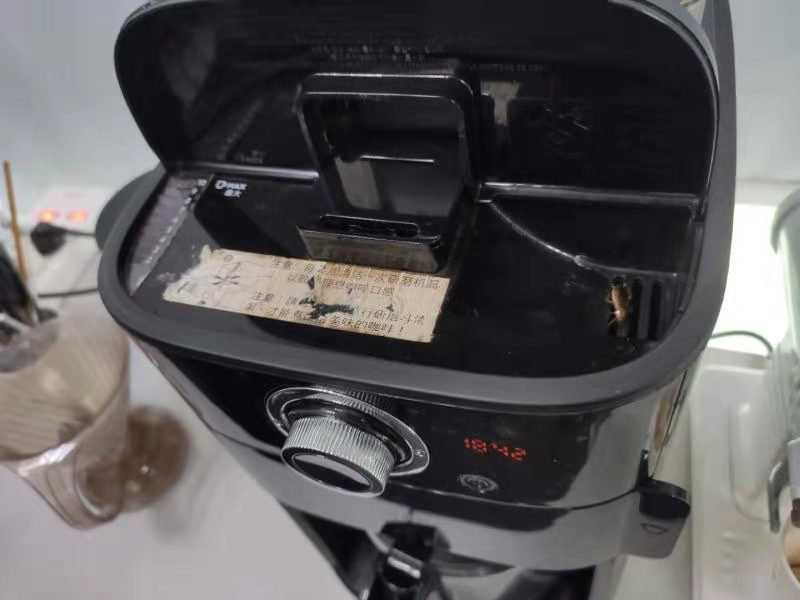

# 关于咖啡

之前借着[v2ex帖子](https://www.v2ex.com/t/779002?p=1)  
总结了下自己的咖啡感受。  
顺便发个帖子。  
`屁大点事发个文系列`

## 关于速溶

我一直喝的是速溶的

### 优缺点

- 首先耗时不大，勺子挖一瓢，放热水按一下（电动的自动搅拌杯）。
- 其次咖啡因摄入量可以自己控制。 不用一杯喝到晚上失眠。
- 缺点是要洗杯子。偷懒就喝完咖啡再来杯热水，自动搅拌一下就当洗了。

### 牌子

- 之前喝的 日本的UCC117
- 后面喝的 `德国的Tchibo` （目前在喝这个）

知乎上推荐的就哪几种 一个一个试着来，  
或者一次性一样都买一个，  
好喝留着，不好喝的放公司让同事们自助。  

### 关于自动搅拌杯

- 之前买的热力转磁力的，转动不受控制、容易坏 、杯子容量还小。
- 后面换了上电池的，400ml，其实容量也小，将就着用了 。（ 31 ￥，要买请挑容量最大的）
- 不用充电的、一是怕漏电，二是接口没得 typc-C 、麻烦、电池公司也有，而且基本上一个季度都不用换。
- 电池仓防水做的也还行。

---

### 其他配件

`牛奶`+`制冰机`

在上家公司，和小伙伴 aa 买了制冰机。  
公司本身有大盒脱脂牛奶无限量提供。  
幸福感直接拉到最高。  
这家马上也都要到位了。  
`改善工作环境小能手`

## 关于咖啡机

- 公司有咖啡机*2，
- 也有胶囊咖啡机*1。

共同的问题是声音大，吵，听着就容易暴躁。

胶囊咖啡机要长期放水箱，水放久了就不太想用。

咖啡机我刚来的时候喜欢玩，后期发现是`小强之家`，  
把我恶心吐了。特别是放豆子和水箱的地方，简直就是自助餐。  
只有公司请人清洗后，才会用一下（磨个豆子冲杯咖啡，中午可以打个奶泡玩）  。
清洗后第二天就不会用了（亲眼看到马上爬进去）。  

