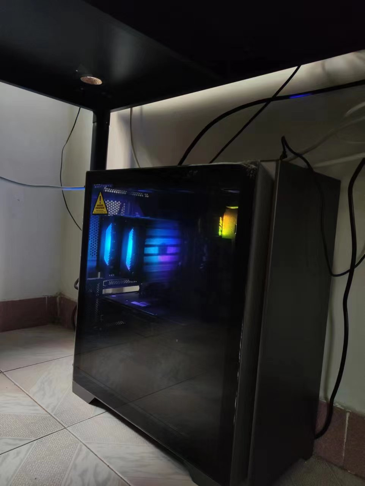
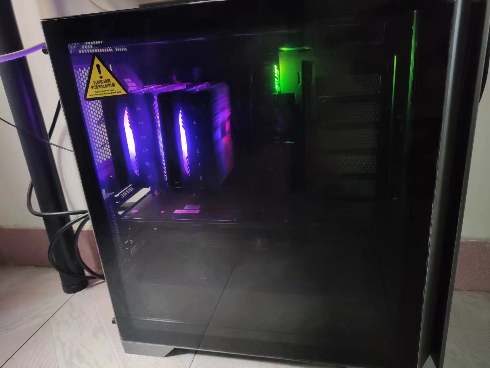

# 组装机配置

- 参考
  - [Gyusang](https://zhuanlan.zhihu.com/p/217881116)
  - [小马哥](https://zhuanlan.zhihu.com/p/574398019)
- 笔记本直接看这个人
  - [夏蒙乾](https://www.zhihu.com/people/xiamengqian)
  - 但是最近（2023-02-09）还是不推荐买，能增加内存、ssd 的机型要么过于贵、要么其他方面不行。

---

## CPU 选择

- [x] CPU
- [x] 主板

- 套餐划算一点
  - [B660M-PLUS + i5-12490F 2388](https://item.jd.com/10003740064.html#crumb-wrap)
  - [B660M-PLUS + i5-12600KF 2849](https://item.jd.com/100018923031.html#crumb-wrap)
  - [B660M-PLUS + i7-12700F 3309](https://item.jd.com/100018923031.html#crumb-wrap)

---

## 总体配置

- CPU+主板 [B660M-PLUS + i7-12700F ￥3109](https://item.jd.com/100018923031.html#crumb-wrap)
  - B660M-PLUS ￥1060
  - i7-12700F ￥2130
  - cpu 65 w
- 散热 利民 PA120 ￥169
- 内存 骇客神条 16g x 2 = ￥1099.00
  - `DDR4 会便宜很多，主板就得换一个（也会便宜很多）`
- 固态 [宏碁 GM7000 1T 649](https://item.jd.com/100027922632.html)
- 电源 酷冷 GX850 ￥594
- 机箱 先马（SAMA）颜之神 钛灰色 ￥226
- 风扇 利民 12 厘米风扇 3 个，安装在尾部和顶部 ￥53
  - `声音大，光太亮了。V`
- 显卡 3070 卡诺基 ￥2199

- 总价 7449

---

## 功率

[最简单粗暴的电源计算办法，把 CPU 和 GPU 的功耗加起来再加上 100W，可以粗略算出配置的整体功耗。】](https://www.zhihu.com/question/517028071)

电源 850w + 100w + 65w (cpu)

