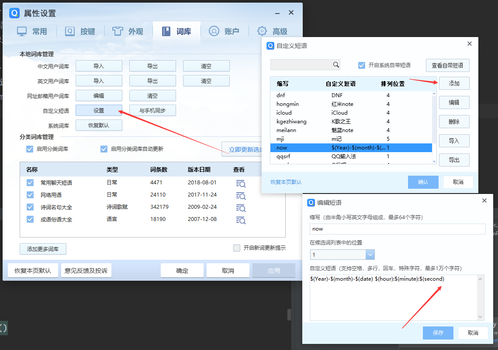

# QQ输入法自定义日期格式

* ``屁大点事发个博文系列。``
* [参考](https://blog.walterlv.com/post/ime-date-time-format.html)

---

首先QQ输入法输入 now 会有一个自带的当前时间短语。

## 改成iso格式的日期

QQ输入法自定义时间语句
`$(Year)-$(month)-$(date) $(hour):$(minute):$(second)`

好了，以后写History.md格式就好统一了。

---

