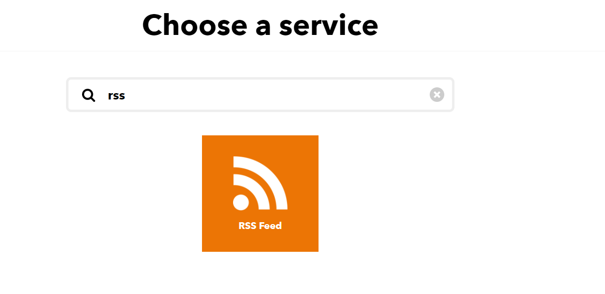
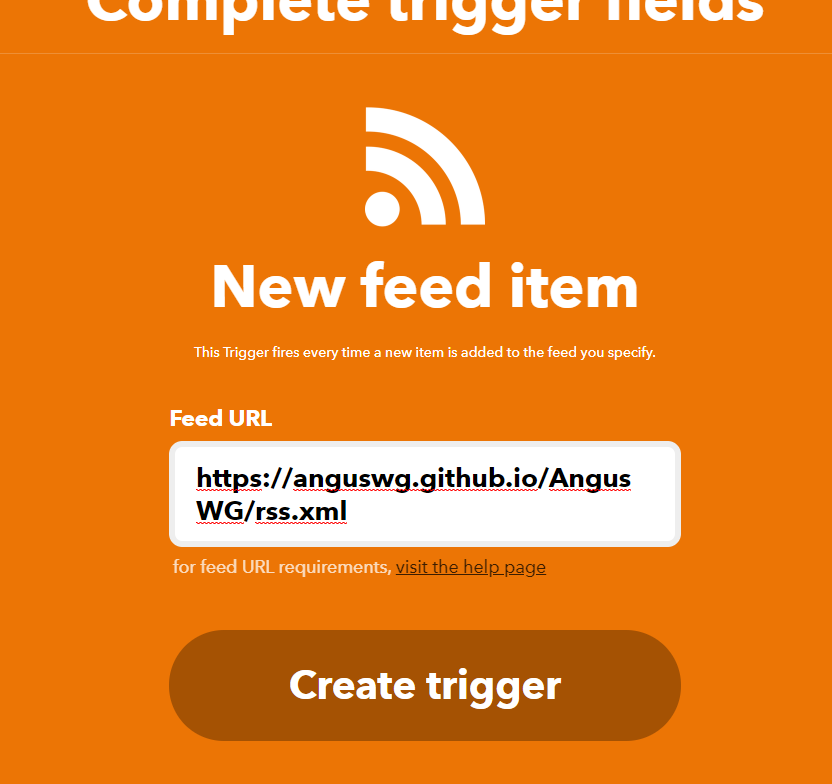
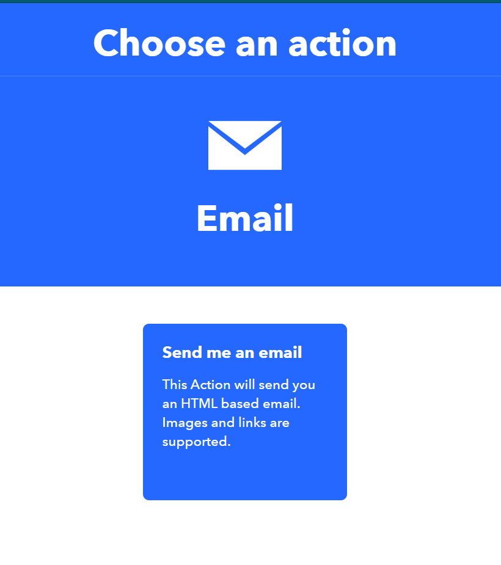

# RSS-博客订阅的普通姿势

* 在博客或者项目底端找到RSS连接,获取URL。  
eg. <https://anguswg.github.io/AngusWG/rss.xml>  

* IFTTT注册账号
* CREATE NEW 创建一条新规则
* IF RSS 增加条件 `如果rss更新`

* THEN EMAIL

---

## feedly

这里有另一个订阅方式 [feedly](../images/https://feedly.com/)
操作上也是获取RSS，贴上去就好了~

