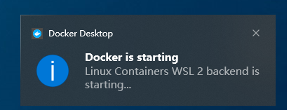
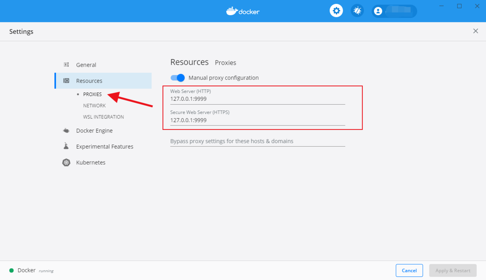
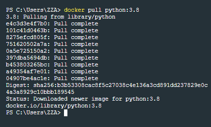
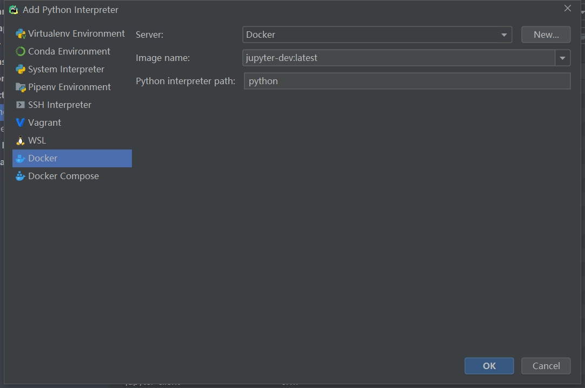
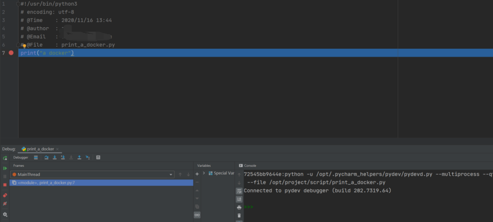

# windows上的docker  

# 安装    
[下载地址](https://hub.docker.com/editions/community/docker-ce-desktop-windows/?tab=resources)    
* 我的windows上装了wsl2    
* 默认点下一步就好了    
    
    
    
安装完成后顺手设置P...    
    
    
    
`ps. wsl telnet 127.0.0.1 9999 失败  我改成了本机ip`    
非常的智能。。。    
    
    
    
---    
    
# 试玩    
    
在docker网站上下个[python镜像](https://hub.docker.com/_/python)玩玩    
>  docker pull python:3.8    
    
    
    
```    
docker run --name docker-tutorial python:3.8 python -c "print('Hello, World!')"    
docker rm docker-tutorial    
docker run --name docker-tutorial python:3.8 python -c "import os;print(os.listdir('.'))"  -v $PWD:/usr/src/myapp  -w /usr/src/myapp    
docker rm docker-tutorial    
```    
    
> -v $PWD/myapp:/usr/src/myapp: 将主机中当前目录下的 myapp 挂载到容器的 /usr/src/myapp。    
> -w /usr/src/myapp: 指定容器的 /usr/src/myapp 目录为工作目录。    
    
    
    
---     
    
# 安装python环境并保存    
    
```    
docker run --name  -it jupyter-dev python:3.8 bash     
pip config set global.index-url https://pypi.douban.com/simple    
pip install jupyter    
exit    
docker ps -a    
docker commit  jupyter-dev jupyter-dev:version1    
docker images    
docker run -d -p 8888:8888 --restart=always  --name jupyter jupyter-dev:version1 jupyter-notebook --ip='*' --port=8888 --allow-root --no-browser --NotebookApp.token=''    
```    
    
    
    
    
    
    
> 关闭     
> ```    
> docker stop jupyter    
> docker rm jupyter    
> ```    
    
    
    
---    
    
# pycharm    
    
* 找不到[docker-machine](https://www.jianshu.com/p/f544acd89f78)     
* EN-找不到[docker-machine](https://github.com/docker/machine/releases)    
* 建议装在windows上    
    
配置python解释器    
    
    
发现并不好用    
[网上教程](https://zhuanlan.zhihu.com/p/52827335)比较好用    
    
不过已经可以愉快的debug了    
    
    
    
    
    
---     
    
# kubectl    
    
> 先装个命令补全    
> ```    
> echo "source <(kubectl completion zsh)" >> ~/.zshrc    
> source ~/.zshrc    
> ```    
找到你想连接的kubectl集群的配置文件    
比如我的在服务器上    
    
```    
rsync -avz root@192.168.20.65:/root/.kube/config /root/.kube/config    
rsync -avz root@192.168.20.65:/root/.minikube/ca.crt /root/.minikube/ca.crt    
rsync -avz root@192.168.20.65:/root/.minikube/profiles/minikube/client.crt /root/.minikube/profiles/minikube/client.crt    
rsync -avz root@192.168.20.65:/root/.minikube/profiles/minikube/client.key /root/.minikube/profiles/minikube/client.key    
```    
然后`kubectl get pods ` 你就会发现都在你本机上看得到了    
    
    
然后就可以获取一个项目的配置文件，然后启动。    
`kubectl get  pods contest-jiantou-64b9cd5597-kvbjp -o yaml`    
    
    
    
    
