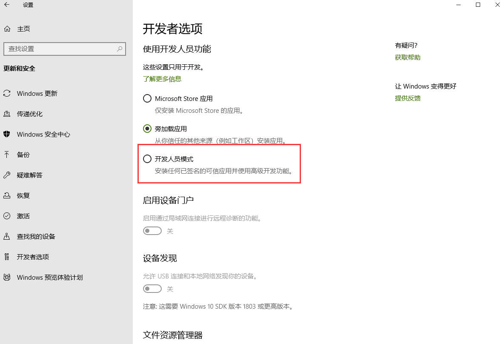
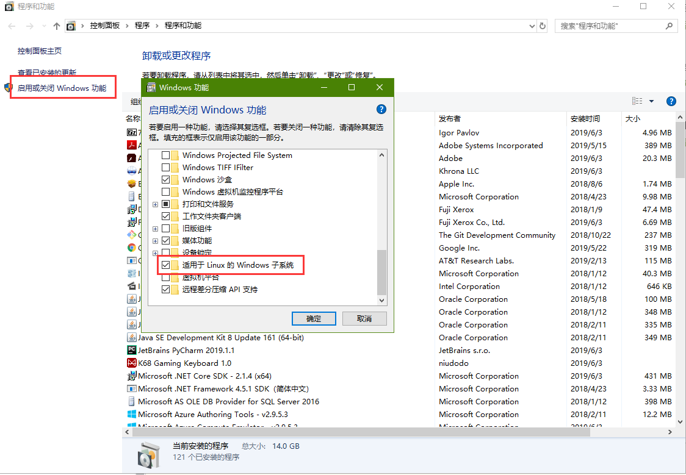
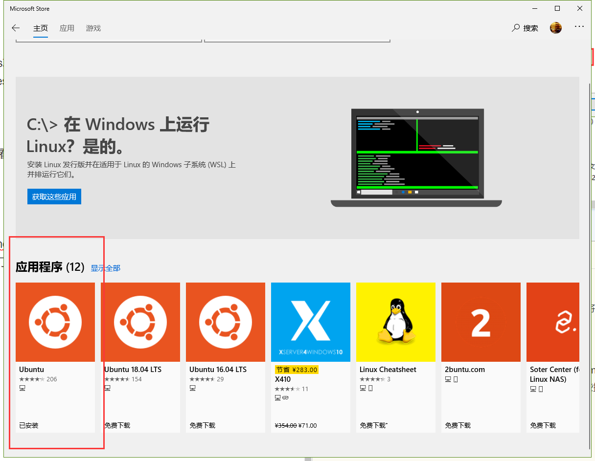
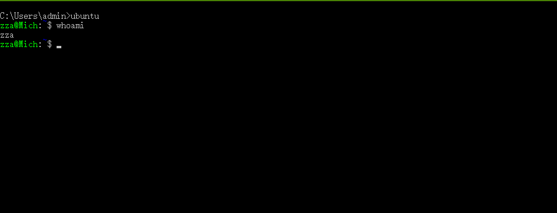
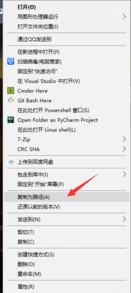
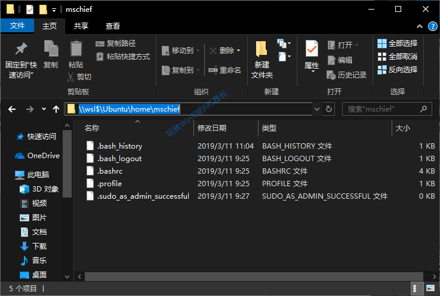
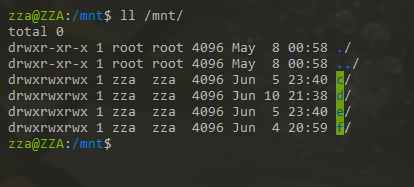
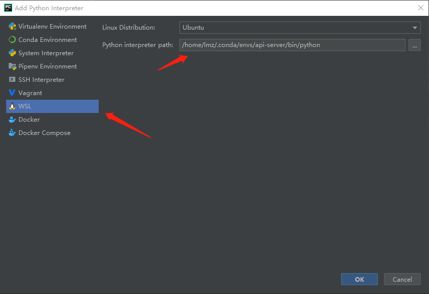
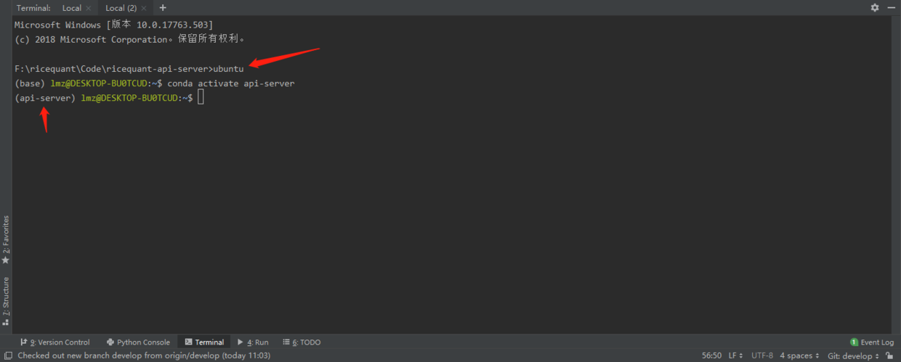
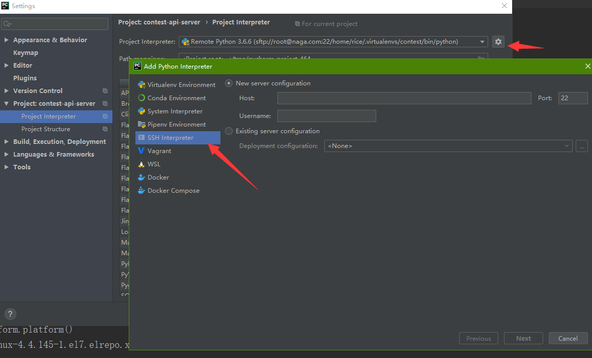

# win10 开发环境相关  

# Ubuntu     
    
    
    
## 安装    
- 打开开发者模式(可选）    
设置菜单 - 更新和安全 - 开发者选项 - 选择开发者模式。    
    
    
- 打开适用于linux的windows子系统    
设置菜单 - 应用和功能 - 程序和功能 - 启动或者关闭windows功能 - 适用于linux的windows子系统 - 打勾 - 重启电脑    
    
    
- 安装ubuntu    
在Mirosoft store中搜索linux，然后点击获取这些应用，将会看到列举的各种linux系统，这里我选着了ubuntu，点击安装即可。    
    
    
- 使用    
安装完后，cmd输入 ubuntu 进入ubuntu系统，主要会要求设置帐号密码    
    
    
# [cmder](https://www.jianshu.com/p/b691b48bcee3)    
- 好看    
- 右键贴贴    
- 大量的 linux 命令：`grep, vim, grep, tar, unzip, ssh, ls, bash, perl, curl(没有 wget) `    
    
安装    
[Cmder官网](http://cmder.net/)下载，解压可用。    
* 把 cmder 加到环境变量    
> 可以把Cmder.exe存放的目录添加到系统环境变量；加完之后,Win+r一下输入cmder,即可。    
    
* 添加 cmder 到右键菜单]    
> 在某个文件夹中打开终端, 这个是一个(超级)痛点需求, 实际上上一步的把 cmder 加到环境变量就是为此服务的, 在管理员权限的终端输入以下语句即可:`Cmder.exe /REGISTER ALL`    
    
    
[* zsh 安装](https://www.jianshu.com/p/7454e05b8a48)    
    
docker(https://www.jianshu.com/p/d1b2b4240256)    
    
# windows包     
用windows环境开发，需要一些环境去编译包，可以考虑直接现成已编译好的。    
> https://www.lfd.uci.edu/~gohlke/pythonlibs/    
    
# 右键复制    
shift + 鼠标右键 选择复制路径    
    
[* 设置默认出现 复制路径选项](https://jingyan.baidu.com/article/fd8044fa08ef155030137a65.html)    
    
# 开发相关    
## [windows 访问 ubuntu](https://www.windows10.pro/access-files-for-windows-subsystem-for-linux/)    
`\\wsl$\Ubuntu\home`    
    
    
## ubuntu 访问 windows    
挂载在`/mnt/`中    
    
推荐使用软连接 连接到Windows需要的组件    
- cmder在Ubuntu中右键贴贴时自动补齐 `/mnt/c/...`    
    
## pycharm中使用Ubuntu的python    
* pycharm 配置python环境    
    
    
* 可以看到ubuntu的实际目录如下    
`C:\Users\74071\AppData\Local\Packages\CanonicalGroupLimited.UbuntuonWindows_79rhkp1fndgsc\LocalState\rootfs\usr\bin`    
    
* 也可以连接服务器解释器 pycahrm会开启一个File Transfer的窗口（自动同步）    
    
    
    
    
cmd中启动环境（比较麻烦 推荐cmder再开一个）    
    
    
# pycharm 远程环境    
- 配置方式    
    
- 本质上是将文件传到服务器/tmp下进行工作    
    
    
