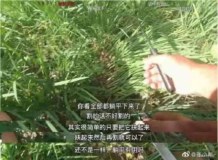

# 后台项目工作的思路整理

随便写写

## 1.监控与错误报警

1. 普罗米修斯监控响应速率 由运维管理  grafana
2. sentry收集报错日志 保存错误触发条件 并报警
3. traceback_with_variables在日志中打印完备触发条件
4. traceback.format_exc() 打印错误栈

## 2.跟踪调试

1. pysnooper 打印每一步
2. IPython.embed 直接打开命令

## 3.开发环境完备

1. CI\CD 托管测试发布上线 节约时间
2. PYPI 托管包
3. versioneer 用git tag管理包版本
4. pip-tools requirements管理
5. Git-hook 提交时单元测试检查

## 4.偷懒

1. cookiecutter建立项目 单元测试 版本管理一步到位
2. docker 自己弄个全家桶 pypi jenkins grafana sentry mongo redis mysql 一步到胃 # todo
3. 弄个项目做为自己的脚本集入口

## 5.项目结构问题

建议直接使用 cookiecutter <https://github.com/AngusWG/cookiecutter-py-package.git>

1. 项目名中划线 包名下划线 避免环境疑难杂症
1. models 文件夹 数据结构+数据库+对象行为
1. views/apis 文件夹 视图相关只管接口
1. env.py 定义基础组件
1. config.py 配置管理

