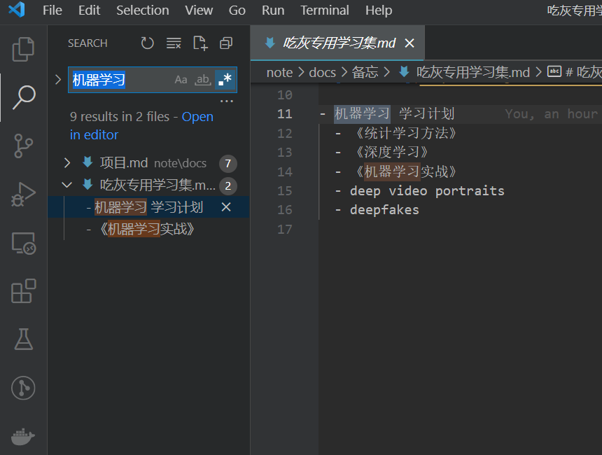
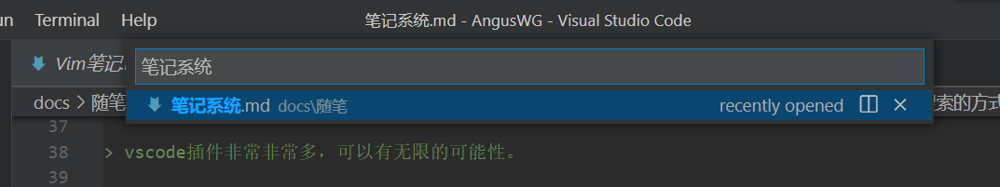

# 笔记系统

最近发现其他人的笔记软件和方法都是很系统化的，感觉自己笔记方案需要进一步升级。

从老石谈芯第一次听说到到第二大脑的概念，觉得需要更系统的了解一下。

感谢`老石谈芯`让我知道啥是`第二大脑`!

## 参考资料

- [老石谈芯-Notion使用技巧分享](https://www.bilibili.com/video/BV1aV411v7te)
- [老石谈芯-第二大脑工作流App分享](https://www.bilibili.com/video/BV1db4y1b7w5)
- [马大伟-我的笔记系统](https://www.bmpi.dev/self/note-system/)
- [马大伟-用OneNote管理你的知识](https://www.bmpi.dev/self/onenote-intro/)
- [BEN HOLMES - Leaving Notion to build a second brain in VS Code](https://bholmes.dev/blog/giving-up-on-notion-to-build-a-second-brain/)

## 新的笔记系统

想用`vscode`做`第二大脑`的小伙伴

可以根着[foam中文项目](https://github.com/AngusWG/foam-template-cn)这个来配置：

- 需要准备一个github帐号
- 把项目clone到本地，然后跟着readme一步一步来就好了

网页笔记导出到markdown推荐用`pagenote`或者`简悦`。

### 关于vscode的优势

> vscode插件非常非常多，可以有无限的可能性。

#### 用搜索的方式去查找内容

比如我想查找机器学习相关的内容,
打开搜索，然后`机器学习`，相关的笔记就会展现了。
不需要通过目录的方式去查找笔记。



如果只想单独搜索文件，可以直接打开命令窗口输入文件名(记得把表示命令的 `>` 去掉)



#### 利用github Action部署你的笔记

可以利用github action来部署你的笔记,
在提交后，将特定文件夹或者特定tag的笔记自动推送到另外一个博客项目，
然后将博客项目直接构建成博客页面。

#### Github Copilot代码补全

这个项目网上介绍很多，就不多说了，懂得都懂。

参考V2上这个帖子: [GitHub Copilot 可以写帮我写中文文章了](https://www.v2ex.com/t/814689)

---

`以下是对旧笔记系统的思考，只是想用vscode作为第二大脑的小伙伴们可以跳过。`

## 目前现有的方案

- vscode 编辑器
- github私有项目远程同步
- vscode - sync note 插件 自动实时`同步`
- vscode - markdown插件，其实阅读主要靠markdown源码（源码可读性本身就很好）图片需要另外的插件
- vscode - paste image `贴图`插件
- vscode - mermaid `画图`插件
- vscode - markdownlint markdown语法检查插件，`保证源码可读性`。
- git做版本管理
- github作为同步服务器

通过参考资料的两个视屏和马大伟大佬的两个文章的整理，我发现我目前使用的博客系统有一下这些问题:

## 目前需要改进的点

- [x] 读书笔记导出成文md文件
- [x] 链接数据库
- [x] 目前vscode项目没有细致分区
- [x] 文件(文章)目录树管理是按名字排序不是任意排序
- [x] 贴图考虑要不要弄到谷歌图床上
- [x] 需要区分私有和公有
- [x] 模版问题
- [ ] 看板视图


### 问题解决方案

#### 读书笔记导出成文md文件

之前是没有意识到读书要做笔记，有非常好的句子或者概念可能会发个微博分享一下。

`不动笔墨不读书`，确实需要系统回顾书本内容，更能转化作者传播的概念。

- 需要阅读软件支持高亮内容和笔记导出。
- 多看阅读支持划线与笔记导出。
- 微信阅读支持划线与笔记导出。
- 后期可能需要脚本统一转换成特定格式至我的笔记系统。

#### 链接数据库

vscode-Foam插件支持链接数据库。

链接数据库其实就是支持给文章增加指针，使得在读本文章时，能方便的跳转到另外一篇文章。

#### 目前vscode项目没有细致分分区

马大伟大佬详细说明了他的笔记系统会有那些分区，分区如下，并贴一下他对分区的描述。我觉得很有参考价值。

- 待办事项
- 交易日记
- 收集
- 备忘
- 知识
- 阅读
- 规划
- 创作
- 项目
- 加密项目

``` text
第一项分区是待办事项。这个对我而言可以记录每天的工作内容，同时可以规划每天及每月的任务。记录每天的任务事项很重要，这可以让你深刻的了解到每天到底是如何度过的：是很充实高效还是碌碌无为假装自己很忙。这份清单不是给别人看的，而是给你内心看的，你想成为什么样的人，这项分区可以告诉你。

第二项分区是交易日记。这个是我之前用来记录每次交易的操作日志。

第三项分区是收集。这个分区你可以把它看做一个信息收集箱，每当你看到不错的文章你可以把它扔进去（OneNote有插件可以让你用浏览器收集文章，也可以使用微信公众号或给它发邮件来收集文章，这些使用技巧你可以自行摸索）。然后非常重要的一步，你每周都需要定期整理，把这些文章做一个处理：再分类或者转化为你的知识。

第四项分区是备忘。你可以把很多重要的事情放进去，这样当你需要的时候你可以很容易的定位到它。

第五项分区是知识。知识是系统化后的信息。这里面你可以放入某个领域的专题，也可以放入自我创作的文章。OneNote右边的分页支持无限分级模式，你可以用子页来划分不同主题的知识。

第六项是阅读。创作的前提是你收集了足够多的信息，而这需要大量的阅读，每当你创作一篇高质量文章的时候，你可能需要几本书的信息量才行。我通过建立不同主题的阅读清单，然后把读过的书通过写读书笔记或者画思维导图的方式来总结，这些你都可以使用OneNote来存储。

第七项是规划。人的成长需要多个规划来确保有计划的执行。我使用这个分区来制定每年的年度规划、个人的长期规划与主题规划。

第八项是创作。创作就是一系列的原创文章，你可以把你需要创作的东西及相关的资料都放入这个分区。

第九项是项目。这项分区用来存放我的个人项目。知识的最高级展示就是你做出自己的作品：书、实体产品、专利、软件或商业模式等。通过知识的积累我相信任何人都可以做出自己的作品。这些作品可以帮助你建立个人品牌或者产生被动收入，这对财务自由很重要。

第十项是加密项目。主要是用来存放一些重要的又实在记不住的个人信息。
```

我实际归档后，还是与大佬的笔记方式不太一样。

首先是第二大脑提出了一个`链接数据库`的概念，同时在[BEN HOLMES - Leaving Notion to build a second brain in VS Code](https://bholmes.dev/blog/giving-up-on-notion-to-build-a-second-brain/)的文章中，
提出了一个人并不需要规整的文件目录结构去管理自己的笔记。

``` markdown
1. Every note is treated as a unique collection of thoughts, tagged by a unique ID of some sort
2. Notes should form an ever-sprawling tree of connected ideas / thoughts. This is pulled off with "links" between notes (references to those unique IDs), much like hyperlinks on the web!
3. You may index multiple "trees" of notes with tags or tables of contents, assuming your Zettelkasten grows pretty large
```

链接库的方式能使得概念或者笔记互相引用，这样更符合互联网思维。

确实是一个更优秀的管理方式(notion这样设计确实前位)。所以我只做了一些必要的文件夹结构避免一个文件夹存在过多文件，但是查找文件主要还是靠vscode的文件和内容搜索功能。

#### 文件(文章)目录树管理是按名字排序不是任意排序

通过Foam实现跳转，常用文件使用了foam提供的tag服务，

在VScode文件浏览器里有tag展示窗口，能非常快的找到自己使用的tag。

#### 贴图考虑要不要弄到谷歌图床上

放弃，万一梯子不好用或者谷歌服务条款变了就GG。还是决定随着放在项目里随着git一起管理。

`Past images`插件支持相对于项目目录去设置存储图片的位置，找个僻静的角落让图片慢慢堆积把。

#### 需要区分私有和公有

本来我的资料就分为公有仓库（博客）与私有仓库（个人常用脚本与笔记集合），

只是欠缺在私有仓库里的整理，先整理完整之后，已经满意了。（感谢github提供的私有仓库服务）

#### 模版问题

Foam支持模版，需要手动从[notion](https://www.notion.so/)里抄一些有用的模版过来。

vscode-snippets也支持模版么，同样从notion里拿就好了(排版问题多用表情，让文字更加鲜活)。

#### 看板视图

TODO.md Kanban Board 插件解决，但是还是不是很好用

目前书籍影视评论还是靠豆瓣去解决。（希望豆瓣能长久运行下去）

待办清档交给微软待办去管理，除了提供的api的导出不好用，个人客户端体验还是非常好的。配合自己写的格式转换脚本，能很好地融合到笔记里。

## 关于第二大脑

我觉得就是`数字化笔记`，让笔记可搜索，互相关联，能追根溯源到文章本身。

做笔记本身需要做到以下内容：加入自己想法、假设写给未来的自己、用自己的话去输出。

网上也有说费曼学习法（Concept概念、Teach教给别人、Review回顾、Simplify简化），我觉得能简化的话，其实会有一定的误导性，能做到前三点就可以了。

在老石谈芯里的app推荐中，我理解到以下几点：

- 把觉得重要的信息（视频，文字）用待办的方式放到有空的时间进行精读。
- 精读的信息需要有划线记录重点，同时能写下自己想法。（需要app支持）
- 能导出这些想法到自己的笔记系统中。
- `定期回顾`自己的笔记与想法，像背单词一样，多出现几次才能正真成为自己的东西。(每天邮件回顾三条)

老石用的instapaper做稍后阅读管理，提炼出重点信息后，通过readwise将高亮导出导入到笔记系统中。并通过readwise实现定期回顾。

视屏下面的评论有说这类app都得翻墙且付费，慢慢找平替把。

## 总结

- vscode使用foam插件，使得笔记管理更加简单，更加方便。用非目录的图的方式链接的笔记。
- 明确了多看阅读，微信阅读记录导出笔记的阅读方式。
- 万物都可记，在连接数据库和vscode本身的搜索能力的帮助下，任何事情都可以记录在‘第二大脑’里。
- [x] 寻找能在网页中划重点并导出成markdown的方案。 -- pagenote插件
- [ ] 寻找能每天定时回顾之前重点内容的方案。
- [ ] 在笔记上加上特定属性后能直接导处到博客中


